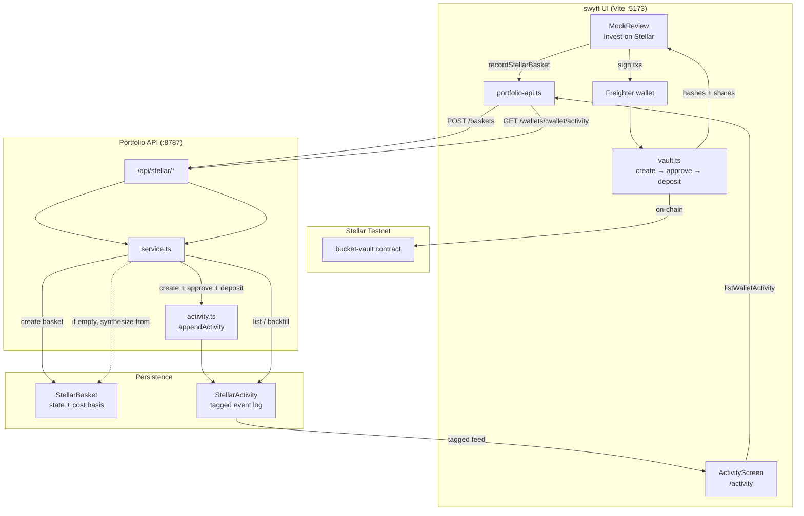

# stellar-crates-tinder

**swyft.fun** — non-custodial swipe investing for tokenized RWAs on **Stellar testnet**.

```
stellar-crates-tinder/
  swyft/    # Vite client + Soroban contracts + scripts
  server/   # Stellar portfolio Express API (Mongo optional)
```

## Quick start

```bash
# UI (Stellar mock / Freighter)
cd swyft && npm install && npm run dev

# Portfolio API (optional — baskets / PnL)
cd server && npm install && npm run dev

# Or both from swyft/
cd swyft && npm run dev:stack
```

Open http://localhost:5173 — **Docs** in the header (or nav after sign-in) for the in-app product guide.

Written docs: [`swyft/docs/PRODUCT_GUIDE.md`](swyft/docs/PRODUCT_GUIDE.md) · full deploy notes: [`swyft/README.md`](swyft/README.md).

## Architecture

Vite proxies `/api` → the portfolio API on `:8787` when you run `npm run dev:stack`.



### Two stores

| Store | Collection | Job |
|---|---|---|
| **StellarBasket** | portfolio state | “What do I own?” — NAV, shares, allocations, cost basis |
| **StellarActivity** | tagged event log | “What happened?” — timeline with tags + tx hashes |

Without `MONGODB_URI`, both fall back to in-memory maps (local mock only).

### Invest write path

1. User confirms in **Review** → Freighter signs `create_bucket` → `approve` → `deposit` on the vault.
2. Client calls `recordStellarBasket(...)` with wallet, bucket id, amounts, and the three tx hashes (`swyft/src/client/stellar/portfolio-api.ts`).
3. Server creates a **StellarBasket** and appends **three StellarActivity** rows: `create`, `approve`, `deposit` (tags such as `basket`, `initial`, `invest`).

### Later ops (same activity log)

| Action | API | Activity kinds |
|---|---|---|
| Extra deposit | `POST /api/stellar/baskets/:id/deposits` | `deposit` |
| Withdraw | `POST /api/stellar/baskets/:id/withdrawals` | `withdraw` (+ `close` if shares → 0) |
| Rebalance | `POST /api/stellar/baskets/:id/rebalances` | `rebalance` |
| Close | `POST /api/stellar/baskets/:id/close` | `close` |

Client helpers: `recordBasketDeposit`, `recordBasketWithdraw`, `recordBasketRebalance`.

### Activity read path

1. **Activity** (`ActivityScreen`) loads `GET /api/stellar/wallets/:wallet/activity`.
2. Server returns `StellarActivity` sorted newest-first.
3. If the log is empty but baskets exist, it **backfills** from basket hashes + ledger, then returns that feed.
4. UI filters by kind (create / deposit / withdraw / rebalance / …) and expands rows for tags + [Stellar.expert](https://stellar.expert/explorer/testnet) links.

### Activity event shape

Each `StellarActivity` document includes:

- `kind`: `create` \| `approve` \| `deposit` \| `withdraw` \| `rebalance` \| `close`
- `tags`: e.g. `["basket", "deposit", "initial", "invest"]`
- `ownerWallet`, `basketId`, `bucketId`, `vaultAddress`, `basketName`
- `usdAmount`, `shares`, `txHash`, `meta` (e.g. allocation symbols), `at`

### Portfolio / activity API surface

| Method | Path | Purpose |
|---|---|---|
| `POST` | `/api/stellar/baskets` | Record new basket + initial create/approve/deposit activity |
| `GET` | `/api/stellar/baskets?wallet=` | List baskets |
| `GET` | `/api/stellar/wallets/:wallet/portfolio` | Active baskets + aggregate PnL |
| `GET` | `/api/stellar/wallets/:wallet/activity` | Tagged transaction history |
| `POST` | `/api/stellar/baskets/:id/deposits` | Record deposit + activity |
| `POST` | `/api/stellar/baskets/:id/withdrawals` | Record withdraw + activity |
| `POST` | `/api/stellar/baskets/:id/rebalances` | Record rebalance + activity |
| `POST` | `/api/stellar/baskets/:id/close` | Close basket + activity |
| `POST` | `/api/stellar/activity` | Append a raw activity event |
| `POST` | `/api/stellar/faucet` | Testnet DEMOUSD mint |
| `GET` | `/api/stellar/health` | Health + Mongo flag |

Key server files: `server/src/models.ts`, `server/src/activity.ts`, `server/src/service.ts`, `server/src/routes.ts`.  
Key client files: `swyft/src/client/stellar/portfolio-api.ts`, `swyft/src/client/components/ActivityScreen.tsx`, `swyft/src/client/mock/MockReview.tsx`.

## Live testnet deployment

Network: **Stellar Testnet** · [Explorer](https://stellar.expert/explorer/testnet)  
Source of truth: [`swyft/src/client/stellar/deploy.json`](swyft/src/client/stellar/deploy.json)

### Supported assets

| Layer | Count |
|---|---|
| **Vault-deployed RWA tokens** (swipe → invest on-chain) | **30** |
| Settlement stablecoin (UI: USDC · on-chain: DEMOUSD SAC) | **1** |
| Breakdown | 18 stocks · 6 ETFs · 4 commodities · 2 FX |

Symbols: `AAPL`, `AMD`, `AMZN`, `DIS`, `GOOG`, `JNJ`, `JPM`, `KO`, `META`, `MSFT`, `NFLX`, `NVDA`, `ORCL`, `PG`, `TSLA`, `V`, `WMT`, `XOM`, `IBIT`, `IVV`, `QQQ`, `SPY`, `TLT`, `VOO`, `NG`, `WTI`, `XAGG`, `XAU`, `EUR`, `JPY`.

UI alias: `GOOGL` → on-chain `GOOG`.

### Core contracts & keys

| Role | Address |
|---|---|
| **Admin** (`demo-admin`) | `GAJFL4R3GOPEZYRASNWKKU7AGCS2Q4TGV7Q2YAGDIPHPR2ZWVF4C23DX` |
| **DEMOUSD issuer** (`demo-usdc-issuer`) | `GDY4CLVS7F5MR2D3ZWAI7SZQAC3ZGIY72FLZ2NC473TDSAJ6NY3TEYSU` |
| **dia-oracle** | [`CCLPSSKT6R2GYJ2Y55NA6ZM2P6IQB2MO47ZIHBJG5OJIDXSW6BLRNRF5`](https://stellar.expert/explorer/testnet/contract/CCLPSSKT6R2GYJ2Y55NA6ZM2P6IQB2MO47ZIHBJG5OJIDXSW6BLRNRF5) |
| **DEMOUSD (SAC, 7 decimals)** | [`CBJ5NPXATRN4U34AGS3AIDFJLOY4KMXFDM4BJT5WYJ3MRY373DGZKELV`](https://stellar.expert/explorer/testnet/contract/CBJ5NPXATRN4U34AGS3AIDFJLOY4KMXFDM4BJT5WYJ3MRY373DGZKELV) |
| **bucket-vault** | [`CBM4MCM4UCKCVMJ5UBT3INU5VF76UKSIDEUC3G4H6K46XFWTPCQBQPO4`](https://stellar.expert/explorer/testnet/contract/CBM4MCM4UCKCVMJ5UBT3INU5VF76UKSIDEUC3G4H6K46XFWTPCQBQPO4) |
| **share-token wasm hash** | `4217581895c609e8be2e4789967f7938650763d5b8a0c9f4481fb67bad1ab0ef` |

Classic trustline: `DEMOUSD:GDY4CLVS7F5MR2D3ZWAI7SZQAC3ZGIY72FLZ2NC473TDSAJ6NY3TEYSU`.

### Asset token contracts (30)

| Symbol | Contract |
|---|---|
| AAPL | `CCFYBBF3XIGKIVDT7S7FTBFBRO5M7GZ7ZIRMVH72WEMBUYIGX4YAKE6V` |
| AMD | `CAU6J5HJ7UOOYU24NP75XFIMG66BAKI7UJG6IP26HMPVTEHWBQTPPVCR` |
| AMZN | `CB45EFZZNN2B3JCD35DHBAHLWKLQRPMDXUY46QZ562RNU6CA3V25WJ52` |
| DIS | `CCM4RBKSHKN4QWDV76W7GUYVYZTNPPOCJF755ZTBEMANBYF7EMHF5NUF` |
| GOOG | `CAYW6YZTYUYQZPOYHWW37JJAWP2ETSQAF6LYJHMXPQLEK34F3OKSATKM` |
| JNJ | `CDDZIIJUN5QIYX6EM25AXE7GUB3V3HJG42MEXQOMODT6W6U7QRZFYKFQ` |
| JPM | `CDJ7LCX7KMKL5QY3NPMDM7MKPSW2KKWXSK4NI4KNUHI26GFVEP6MCXSV` |
| KO | `CDVPSY4R4LZGNURCMAIXW4CNZ3WAA4J6RPDCIBXZR5XX6CWDZN37DAUC` |
| META | `CCKVKUR5DXFUTAET5IOQTRZWW6ETYFNO27TMHURTGAXKJ7L4UJ5BWLII` |
| MSFT | `CAOZ5TJTEMTYNWPBNDEPMNYATKFQG56PWXNYD4SACTN2PILMQ62YZT7E` |
| NFLX | `CAD7M6FVUEB3GKTDIUNS35EQ2PIJIAWRLAIYP7PMWHTEQFELODLGUCKN` |
| NVDA | `CC7XSYW3O4X6ERQ6EFD3PZ7NSCEFYTYOTPQHOEPY5S6LPFWP2Z5I7UFT` |
| ORCL | `CD3FBQNBN3BNP6AN3VLB6IAOWZFNS6AI5GFTEVAI5ZQHY2KM6TF3EWAW` |
| PG | `CA6THUOBFR6J7PGHFWCFKGJ26XTI42ACG2ZHJG4CF5XQOEVVYKDPGKZR` |
| TSLA | `CCCWBXCHOQHK5TAAMAKZZYL36NSXXP5CDTRY534GECZ6W5243RBWKVKN` |
| V | `CAIGVSUCMRJXOJXLXWJ7LKOA7MBREBWM7YKNMTXAREDAIFDYO5WUHPVU` |
| WMT | `CBK456SIHMCME2AIJQF74WKVFYYIURWTYG27M4GNWJALCM3YOAL5HQSX` |
| XOM | `CD47HDOU2TYYMDKGIZT7CB5DDUQGKYQAMTVHX5S2I6MGX2NFJZ272KQL` |
| IBIT | `CA7JPBHKM2WIHB5VW4G66CP65WXWAYYVR7JCTCEYL6ZJHBXQG6QYRAAI` |
| IVV | `CAT4FOF7U5PR5S47JP2PMHR3OK3SZVZR75YSH6NCCGZ6NS7ERKOUWP6P` |
| QQQ | `CD452FHCW7J6HIQM6NRUPNNMKP466W2C37SJDEXZVX3TRPE5FEY67CY3` |
| SPY | `CCLNACNASCKOTUWMODJI7PZHL7N5B6EWFUD5JAU7ZBHXJ6OXYLEQCOTX` |
| TLT | `CCGOB5XCFRY42Y6VJL23QXV7GZKMYICSJIMQTUM7PC36UNAXDPNZOQJY` |
| VOO | `CAAUI3BLHKQTFOAISWVDS4XDH4AAQICU4CFOGVIZ2NNAMXSPMONLRR5B` |
| NG | `CB52CF4JTZHNV2A76R3Y3MAJYPUQCEPALCJWNBT2OUXTHJO2FI3T2QHR` |
| WTI | `CAP45F3NIX76KCABVZWM3OTTMISZIYVVETEVCPQTGXGBDWH2HS2V5S5R` |
| XAGG | `CARXGD3APQ4HV7EJ43LKJOPYPWI4KI4Q5UTKBM4Z5PFY6R4CZX27BGB4` |
| XAU | `CBID5UQVJHNOD7RWL6XFZKVY72IUEC4NJBNGIEVPPNXVN57YDLSCOHJT` |
| EUR | `CAGGFGAXHLRNXJQFE2QYB23RMLSJC7Z35FJD2IMA2OGN7NIA3PYMPPCO` |
| JPY | `CCI5IBAHBYCGMZZPCX7NRTBJPYVE7QHJC7FTL2G6XOV5R4Q53XHJDQBJ` |

Oracle feed IDs are `SYMBOL/USD` (plus `USDC/USD` for settlement). Keep them fresh with:

```bash
cd swyft && node scripts/update-oracle-feeds.mjs --watch
```
