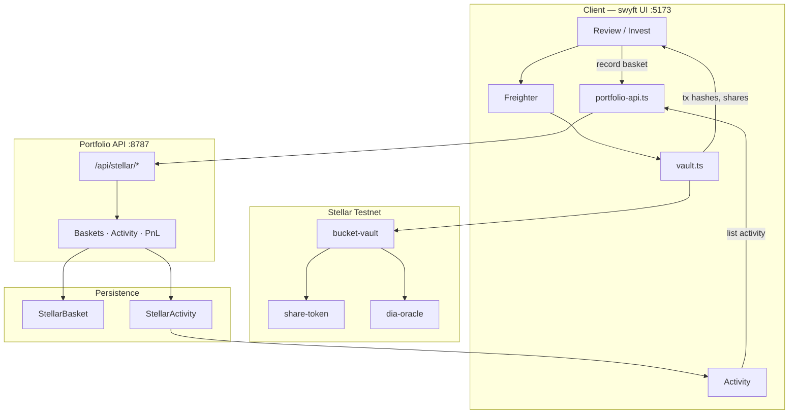

# swyft.fun

**Non-custodial swipe investing for tokenized RWAs on Stellar.**

Set a budget, swipe assets into a basket, deposit stablecoin on testnet via Freighter, and hold vault share tokens. Prices come from DIA-compatible oracles; portfolio state and a tagged transaction history live in the portfolio API.

| | |
|---|---|
| **Product** | [swyft.fun](https://swyft.fun) (Stellar testnet demo) |
| **Network** | [Stellar Testnet](https://stellar.expert/explorer/testnet) |
| **Wallet** | [Freighter](https://www.freighter.app/) (Testnet) |
| **Monorepo** | `swyft/` (UI + contracts) · `server/` (portfolio API) |

> **Status:** Testnet demo. Not mainnet production capital. Settlement asset is on-chain **DEMOUSD** (shown in the UI as USDC).

---

## Features

- **Swipe-to-basket** allocation with fixed ticket size and period limits
- **Non-custodial** invest path: Freighter signs `create_bucket` → USDC approve → `deposit`
- **Personal vault buckets** — one owner per basket; many baskets per wallet
- **Rebalance** — one signature moves drifted legs back to target weights against vault pools (±2% drift band, $1 min trade, 1% slippage bound)
- **Withdraw** — burn shares for the pro-rata slice of every held asset + idle USDC (approve + withdraw signatures)
- **30 tokenized RWAs** (stocks, ETFs, commodities, FX) + DEMOUSD settlement
- **Portfolio & PnL** via DIA spots (Mongo-backed when configured)
- **Activity history** — tagged create / approve / deposit / withdraw / rebalance / close events with explorer links
- **Testnet faucet** — Friendbot XLM + DEMOUSD mint for demo wallets

---

## Repository layout

```text
stellar-crates-tinder/
├── swyft/                 # Vite client, Soroban contracts, deploy scripts
│   ├── src/client/        # UI (default: mock/Stellar Freighter surface)
│   ├── contracts/         # bucket-vault, share-token, dia-oracle
│   ├── scripts/           # deploy, oracle updater, faucet
│   └── docs/              # product & contract docs
└── server/                # Express portfolio API (:8787)
    └── src/               # baskets, activity log, PnL, faucet
```

| Package | Role |
|---|---|
| [`swyft/`](swyft/README.md) | App UI, Soroban workspace, deploy & oracle tooling |
| [`server/`](server/README.md) | Baskets, activity, PnL, DEMOUSD faucet |

---

## Prerequisites

- **Node.js** ≥ 22
- **Freighter** browser extension on **Testnet**
- **MongoDB** (optional) — required for durable baskets & activity across restarts
- **Rust / Soroban CLI** — only if you rebuild or redeploy contracts

---

## Quick start

```bash
# 1. Install
cd swyft && npm install
cd ../server && npm install

# 2. (Recommended) Persist portfolio + activity
cp server/.env.example server/.env
# edit MONGODB_URI, then:

# 3. Run UI + portfolio API together
cd swyft && npm run dev:stack
```

Open **http://localhost:5173**.

| Command | What it starts |
|---|---|
| `cd swyft && npm run dev:stack` | UI (`:5173`) + portfolio API (`:8787`) — **recommended** |
| `cd swyft && npm run dev` | UI only (no faucet / portfolio persist) |
| `cd server && npm run dev` | Portfolio API only |

Vite proxies `/api` → `http://localhost:8787`.

### Environment (`server/.env`)

```bash
MONGODB_URI=mongodb://127.0.0.1:27017/swyft   # omit → in-memory (lost on restart)
STELLAR_PORTFOLIO_PORT=8787
PUBLIC_ORIGIN=http://localhost:5173
```

---

## Product flow

1. Open the app → connect **Freighter** (Testnet).
2. Set cadence, period limit, ticket size, and asset mix.
3. Swipe RWAs into a basket.
4. On Profile / Review, **Get testnet USDC** if the wallet needs DEMOUSD.
5. **Invest on Stellar** — three signatures: create bucket → approve → deposit. The deposit lands as idle DEMOUSD in your bucket.
6. Open **Portfolio**, expand the basket → **Rebalance** deploys that idle cash into the target weights (one signature). Rerun any time legs drift past ±2% of target.
7. **Withdraw** a percentage (25 / 50 / 100%) — two signatures: share-burn allowance, then burn shares for the pro-rata asset payout.
8. Portfolio API records every step; PnL marks against DIA spots; **Activity** shows the tagged history with Stellar.expert links.

In-app guide: **Docs** in the header. Written guide: [`swyft/docs/PRODUCT_GUIDE.md`](swyft/docs/PRODUCT_GUIDE.md).

---

## Architecture



### On-chain lifecycle

```text
create_bucket(name, allocations)
  → vault deploys share-token (admin = vault)
approve(usdc → vault)
deposit(bucket_id, amount)
  → vault pulls DEMOUSD, mints shares at pre-deposit NAV
  → funds sit as idle USDC until first rebalance
rebalance(bucket_id, deadline, slippage_bps, min_outs)
  → permissionless keeper call; trades drifted legs back to target
    against vault-owned constant-product pools; min_outs bound every swap
withdraw(bucket_id, user, shares)
  → requires a share-token allowance (user approves the vault, then signs withdraw)
  → burns shares, pays pro-rata slice of all holdings + idle USDC
```

Rebalance parameters: drift band ±2% (`drift_bps`), $1 minimum trade, hard slippage ceiling 10% (UI sends 1%), deadline 5 minutes. The UI computes `min_outs` off-chain from DIA spots + live pool reserves.

Withdrawal note: OZ `burn_from` spends an owner→vault allowance on the share token — that's why withdraw is two signatures.

Contract details: [`swyft/docs/CONTRACTS.md`](swyft/docs/CONTRACTS.md).

### Data model

| Store | Purpose |
|---|---|
| **StellarBasket** | Current portfolio state — allocations, cost basis, shares, deposit/withdraw ledger |
| **StellarActivity** | Append-only tagged timeline — create, approve, deposit, withdraw, rebalance, close |

Without MongoDB both stores are **in-memory** (local demo only).

**Activity event fields:** `kind`, `tags`, `ownerWallet`, `basketId`, `bucketId`, `vaultAddress`, `basketName`, `usdAmount`, `shares`, `txHash`, `meta`, `at`.

On first Activity load, if the event log is empty but baskets exist, the API **backfills** events from basket hashes and ledger entries.

---

## Portfolio API

Base URL (local): `http://localhost:8787` · proxied in the UI as `/api/stellar`.

| Method | Path | Purpose |
|---|---|---|
| `POST` | `/baskets` | Record basket after invest; emits create + approve + deposit activity |
| `GET` | `/baskets?wallet=` | List baskets |
| `GET` | `/baskets/:id` | Basket by id |
| `GET` | `/baskets/:id/pnl` | Mark-to-market PnL (DIA) |
| `GET` | `/wallets/:wallet/portfolio` | Active baskets + aggregate PnL |
| `GET` | `/wallets/:wallet/activity` | Tagged transaction history |
| `POST` | `/baskets/:id/deposits` | Record deposit + activity |
| `POST` | `/baskets/:id/withdrawals` | Record withdraw + activity |
| `POST` | `/baskets/:id/rebalances` | Record rebalance + activity |
| `POST` | `/baskets/:id/close` | Close basket + activity |
| `POST` | `/activity` | Append a raw activity event |
| `POST` | `/faucet` | Mint testnet DEMOUSD |
| `GET` | `/health` | Liveness + Mongo flag |

Full reference: [`swyft/docs/STELLAR_PORTFOLIO_API.md`](swyft/docs/STELLAR_PORTFOLIO_API.md).

| Later ops | Activity kinds |
|---|---|
| Deposit | `deposit` |
| Withdraw | `withdraw` (+ `close` when shares hit zero) |
| Rebalance | `rebalance` |
| Close | `close` |

---

## Documentation

| Doc | Contents |
|---|---|
| [`swyft/docs/PRODUCT_GUIDE.md`](swyft/docs/PRODUCT_GUIDE.md) | End-user product guide |
| [`swyft/docs/ARCHITECTURE.md`](swyft/docs/ARCHITECTURE.md) | Client ↔ Soroban architecture |
| [`swyft/docs/CONTRACTS.md`](swyft/docs/CONTRACTS.md) | Vault, shares, oracle, invest invariants |
| [`swyft/docs/USER_FLOW.md`](swyft/docs/USER_FLOW.md) | Screen-by-screen journey |
| [`swyft/docs/STELLAR_PORTFOLIO_API.md`](swyft/docs/STELLAR_PORTFOLIO_API.md) | Portfolio API reference |
| [`swyft/docs/STELLAR_CHECKLIST.md`](swyft/docs/STELLAR_CHECKLIST.md) | Testnet demo / release checklist |
| [`swyft/README.md`](swyft/README.md) | UI, contracts, deploy & oracle tooling |
| [`server/README.md`](server/README.md) | Portfolio API quick start |

---

## Live testnet deployment

**Network:** Stellar Testnet · [Explorer](https://stellar.expert/explorer/testnet)  
**Source of truth:** [`swyft/src/client/stellar/deploy.json`](swyft/src/client/stellar/deploy.json)

### Supported assets

| Layer | Count |
|---|---|
| Vault-deployed RWA tokens | **30** |
| Settlement stablecoin (UI: USDC · on-chain: DEMOUSD SAC) | **1** |
| Mix | 18 stocks · 6 ETFs · 4 commodities · 2 FX |

**Symbols:** `AAPL`, `AMD`, `AMZN`, `DIS`, `GOOG`, `JNJ`, `JPM`, `KO`, `META`, `MSFT`, `NFLX`, `NVDA`, `ORCL`, `PG`, `TSLA`, `V`, `WMT`, `XOM`, `IBIT`, `IVV`, `QQQ`, `SPY`, `TLT`, `VOO`, `NG`, `WTI`, `XAGG`, `XAU`, `EUR`, `JPY`

UI alias: `GOOGL` → on-chain `GOOG`.

### Core contracts

| Role | Address |
|---|---|
| Admin (`demo-admin`) | `GDVJOVCZBKQY5FIDMRFDEVCQ3M6MP2BG4KYPDO6FJ2KUOLQPUWIEIW2M` |
| DEMOUSD issuer (`demo-usdc-issuer`) | `GAK7PGZIGH2ASZY6LF762ACROPQGBF7X4ZNUMPIMMOEP5ZFTGWTSA4TY` |
| dia-oracle | [`CDME5DBW…F2T6A`](https://stellar.expert/explorer/testnet/contract/CDME5DBWV5CRHY6WHIN2KPDLMPJVHKH2J3PWY6AFILIC7HRZHAJF2T6A) |
| DEMOUSD SAC (7 decimals) | [`CDLPZ6OA…CRAA`](https://stellar.expert/explorer/testnet/contract/CDLPZ6OAYSNO4LNXKL3GCLG57KTOQRBXWEE775XO3CUC4Y7GOBV2CRAA) |
| bucket-vault | [`CDRVFECR…EELKQ`](https://stellar.expert/explorer/testnet/contract/CDRVFECRSEWANIVJJVGGPPAM4VKKDVJLL2NQYRZQNNQN3P27AH4EELKQ) |
| share-token wasm hash | `62d2e1ad01c76bb7f6ca8c244e0341b9e0f9a11a66482154cad45422caf118d0` |

Classic trustline: `DEMOUSD:GAK7PGZIGH2ASZY6LF762ACROPQGBF7X4ZNUMPIMMOEP5ZFTGWTSA4TY`.

### Asset token contracts (30)

| Symbol | Contract |
| AAPL | `CDUFA63JRHVMHOBEPSZQKE5T36CUEP5QG4J6CHKFUZGZELJFNFUVFXYI` |
| AMD | `CBHU7WF3PWM3EHFMKVPRVKGDNYBETT6I7HYU44VFKX3K7INVXMQQGEP6` |
| AMZN | `CD3N25FENUSLJGT2IW6ZGQSVR4XI4XJOWWDSY6SNXWHZB3GAQHOCP4G2` |
| DIS | `CDKJKZMB5DIU3ZUTOIOOYK3J22OIYSISXGOUMAFYMGT757KHMOCD6Q3N` |
| GOOG | `CDNACMQBEMUQ64YORZMKBEX6L6Z72AT4AW5KWAGXXF4RKOHSK4UZUMUC` |
| JNJ | `CCJCPKLIVEGJPQAG2QFCL4X43THNU35WTYVELISC2MBA773WFBYKXKO4` |
| JPM | `CCWHKPDGTMSY73TEWJ4WLQ3H2X6OXMRG3UOQOGRWZU2JXU22L6LSHPKL` |
| KO | `CDCYRWYP4SVF4TCSI3IMRXHQA7SG5IS2OT4JFIHB77S3YYABZINUKM54` |
| META | `CDW5HHETN4KWESC3SHY3723H5MAJLBMBG6VUOEQ7LO6ZNJI6HOMR22J5` |
| MSFT | `CCFRV722CSIRN3DKMDV7TEMGMZXOB5H3BHWCCUZ3O3KRO5MYTD444AAC` |
| NFLX | `CCU5LWUSIOCV7B7FRGMF27LBQSPVM7PPVK3RXHK5CKF6KTX2IZZUVZQ4` |
| NVDA | `CC6SWZYSTSVKGYS3765C4M72ZHEUF7CE6JLHSNT3CO6ABV2XXG4DJNWW` |
| ORCL | `CBZOG7SEE3YGHJGS4QP463QZ3DOVOMFFDP55XWSWC6UEOXFRYLQ2V263` |
| PG | `CBB5MU7OPER2YRTEC2OJPRBTMK6EMOHXP5YPLPIESFUJYQW45MVD5P7I` |
| TSLA | `CBJFFJHS5VKEAB4YM4XUPE2V7PNWUOW2VMYSMGR2PC6JFKWQ37RTWSAC` |
| V | `CCGMLF2XBRNCZGXN573JC7WXIF2OMRYKOM57GPNCDW2EB3BU6XLN7V5L` |
| WMT | `CDZPWGU2IQRGTWXOFO6MRTBS37KSTL4ELQBTDK3W47HEJLVRKRAPCJBG` |
| XOM | `CBISP2WLZS3SJDXPLGH4CBK5LZ6WZLKB64KKYHQVYO4QZKOYVWPAS4BI` |
| IBIT | `CBZIOQGTYQCLM7FNMBLQTSQQBIS5PADYROBOWDLXQW2GW4BGYTE5GJPQ` |
| IVV | `CDGH7U6PB5E632ULAGVWN2WKKDFMOHCZEV3Q6LREKODN26NAJBDU3QEF` |
| QQQ | `CDJMORZ2V62CJZ76NGAJSKFOGQTUSBLI6F4AI3PHM4Y66BUESHZJDEQM` |
| SPY | `CB6TKC3727CVDELEFNJBGQAT7GBKJPUYBTHJO7TKEXAXOKOMO6XTDZUR` |
| TLT | `CASYL5HOPBXQNB5QYQ76ET7GOR55ZZ3LRAD3FMIMCVJN5XBLERO3NGZY` |
| VOO | `CCA4NDSXHA3XIFQK4U3ZZ6A55TV2CPRQ7OZ2RIXHPJU3VHQZY7ODQ3W7` |
| NG | `CCGTJTXPBIHI7BHW6TXOUD32AYL6VPOANDXUUDGWM4Z2GK7DJLXRGJWA` |
| WTI | `CC34QUVU2WXYEL33BWUPRIEWDPWMXEYXMG6CA26OISEPA64VPHK5GFDS` |
| XAGG | `CA33DXW4VA2W2KJZMFPSDEUC4S3SS2GFOYI24KL64R5RVSCBEI7O6J7U` |
| XAU | `CBBMQ6O4IZYZ6IL7VTF2HQY6NC55YFLT4HKM6TRL7AQQDTBE4DUKHDTJ` |
| EUR | `CA2WWEAPNHXY4P52I7C4R2YTBY5LE3KWYHDK66YFODB5FCCKAGIGIPDR` |
| JPY | `CD6U4JNQERR74ZF3S7TGQCGZXQOO3NP2XEJFHBWO7RGQD5GCPTIWPWOV` |

Oracle feed keys are `SYMBOL/USD` (plus `USDC/USD` for settlement). Keep them fresh:

```bash
cd swyft && npm run oracle:update
# or
node scripts/update-oracle-feeds.mjs --watch
```

### Redeploy contracts

Idempotent — reruns fill in only the missing steps (state: `swyft/scripts/.stellar-deploy.json`):

```bash
cd swyft
npm run build:contracts
node scripts/deploy-stellar.mjs        # writes deploy.json automatically
node scripts/update-oracle-feeds.mjs --watch   # keep feeds fresh (separate terminal)
```

The deploy script generates + friendbot-funds the `demo-admin` / `demo-usdc-issuer` CLI identities if missing. Both are required locally for the faucet (`stellar keys ls` should list them).

### Full reset (fresh deployment, e.g. identities lost)

```bash
cd swyft
mv scripts/.stellar-deploy.json scripts/.stellar-deploy.json.bak   # old state pins old addresses
rm src/client/stellar/deploy.json                                  # regenerated by deploy script
npm run build:contracts
node scripts/deploy-stellar.mjs                                    # ~10 min: keys, oracle, 105 feeds, USDC, vault, 30 tokens, pools, buckets
```

Wallets with trustlines to a previous DEMOUSD issuer must re-add the trustline for the new issuer (the UI prompts via Freighter on faucet use).

---

## Troubleshooting

| Symptom | Cause | Fix |
|---|---|---|
| `MongooseServerSelectionError: connect ECONNREFUSED 127.0.0.1:27017` | Mongo not running but `MONGODB_URI` set | Start MongoDB, or comment out `MONGODB_URI` in `server/.env` → in-memory store (data lost on restart) |
| `Failed to find config identity for demo-usdc-issuer` | Stellar CLI identities missing on this machine | Run the deploy (auto-creates them), or full reset above |
| Faucet mints but balance doesn't show | Trustline points at an old DEMOUSD issuer | Sign the new change-trust prompt in Freighter (UI offers it), then retry |
| Rebalance does nothing | All legs within ±2% drift band or trades under $1 | Expected no-op; drift appears as prices move |
| Withdraw simulation fails with contract error #101 | Share-burn allowance missing/expired | Retry — the UI re-approves before every withdraw |

---

## Security & disclaimer

- Users sign every transaction in Freighter; the app does **not** custody keys or funds.
- Current deployment targets **Stellar testnet** with a demo stablecoin (**DEMOUSD**).
- Portfolio metadata is application-indexed off-chain; on-chain state remains authoritative for balances and shares.
- This software is provided for demonstration and development. Do not treat testnet balances as real value.

---

## License

See [`swyft/LICENSE`](swyft/LICENSE).
