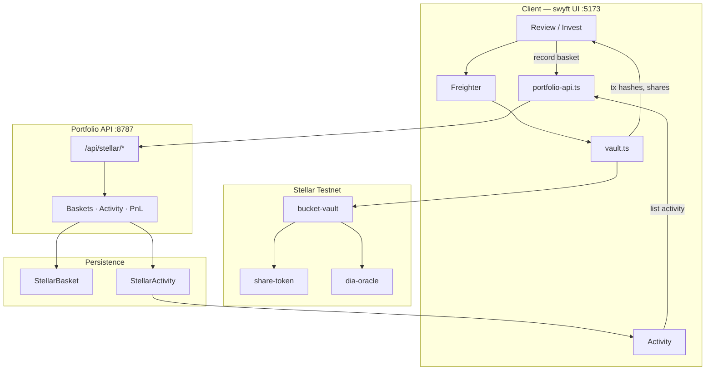

# swyft.fun

**Non-custodial swipe investing for tokenized RWAs on Stellar.**

Set a budget, swipe assets into a basket, deposit stablecoin on testnet via Freighter, and hold vault share tokens. Prices come from DIA-compatible oracles; portfolio state and a tagged transaction history live in the portfolio API.

| | |
|---|---|
| **Product** | [swyft.fun](https://swyft.fun) (Stellar testnet demo) |
| **Network** | [Stellar Testnet](https://stellar.expert/explorer/testnet) |
| **Wallet** | [Freighter](https://www.freighter.app/) (Testnet) |
| **Monorepo** | `swyft/` (UI + contracts) · `server/` (portfolio API) |

> **Status:** Testnet demo. Not mainnet production capital. Settlement asset is on-chain **DEMOUSD** (shown in the UI as USDC).

---

## Features

- **Swipe-to-basket** allocation with fixed ticket size and period limits
- **Non-custodial** invest path: Freighter signs `create_bucket` → USDC approve → `deposit`
- **Personal vault buckets** — one owner per basket; many baskets per wallet
- **30 tokenized RWAs** (stocks, ETFs, commodities, FX) + DEMOUSD settlement
- **Portfolio & PnL** via DIA spots (Mongo-backed when configured)
- **Activity history** — tagged create / approve / deposit / withdraw / rebalance / close events with explorer links
- **Testnet faucet** — Friendbot XLM + DEMOUSD mint for demo wallets

---

## Repository layout

```text
stellar-crates-tinder/
├── swyft/                 # Vite client, Soroban contracts, deploy scripts
│   ├── src/client/        # UI (default: mock/Stellar Freighter surface)
│   ├── contracts/         # bucket-vault, share-token, dia-oracle
│   ├── scripts/           # deploy, oracle updater, faucet
│   └── docs/              # product & contract docs
└── server/                # Express portfolio API (:8787)
    └── src/               # baskets, activity log, PnL, faucet
```

| Package | Role |
|---|---|
| [`swyft/`](swyft/README.md) | App UI, Soroban workspace, deploy & oracle tooling |
| [`server/`](server/README.md) | Baskets, activity, PnL, DEMOUSD faucet |

---

## Prerequisites

- **Node.js** ≥ 22
- **Freighter** browser extension on **Testnet**
- **MongoDB** (optional) — required for durable baskets & activity across restarts
- **Rust / Soroban CLI** — only if you rebuild or redeploy contracts

---

## Quick start

```bash
# 1. Install
cd swyft && npm install
cd ../server && npm install

# 2. (Recommended) Persist portfolio + activity
cp server/.env.example server/.env
# edit MONGODB_URI, then:

# 3. Run UI + portfolio API together
cd swyft && npm run dev:stack
```

Open **http://localhost:5173**.

| Command | What it starts |
|---|---|
| `cd swyft && npm run dev:stack` | UI (`:5173`) + portfolio API (`:8787`) — **recommended** |
| `cd swyft && npm run dev` | UI only (no faucet / portfolio persist) |
| `cd server && npm run dev` | Portfolio API only |

Vite proxies `/api` → `http://localhost:8787`.

### Environment (`server/.env`)

```bash
MONGODB_URI=mongodb://127.0.0.1:27017/swyft   # omit → in-memory (lost on restart)
STELLAR_PORTFOLIO_PORT=8787
PUBLIC_ORIGIN=http://localhost:5173
```

---

## Product flow

1. Open the app → connect **Freighter** (Testnet).
2. Set cadence, period limit, ticket size, and asset mix.
3. Swipe RWAs into a basket.
4. On Profile / Review, **Get testnet USDC** if the wallet needs DEMOUSD.
5. **Invest on Stellar** — three signatures: create bucket → approve → deposit.
6. Portfolio API records the basket and activity events; PnL marks against DIA spots.
7. **Activity** shows the tagged history with Stellar.expert links.

In-app guide: **Docs** in the header. Written guide: [`swyft/docs/PRODUCT_GUIDE.md`](swyft/docs/PRODUCT_GUIDE.md).

---

## Architecture



### On-chain invest path

```text
create_bucket(name, allocations)
  → vault deploys share-token (admin = vault)
approve(usdc → vault)
deposit(bucket_id, amount)
  → vault pulls DEMOUSD, mints shares at pre-deposit NAV
```

Contract details: [`swyft/docs/CONTRACTS.md`](swyft/docs/CONTRACTS.md).

### Data model

| Store | Purpose |
|---|---|
| **StellarBasket** | Current portfolio state — allocations, cost basis, shares, deposit/withdraw ledger |
| **StellarActivity** | Append-only tagged timeline — create, approve, deposit, withdraw, rebalance, close |

Without MongoDB both stores are **in-memory** (local demo only).

**Activity event fields:** `kind`, `tags`, `ownerWallet`, `basketId`, `bucketId`, `vaultAddress`, `basketName`, `usdAmount`, `shares`, `txHash`, `meta`, `at`.

On first Activity load, if the event log is empty but baskets exist, the API **backfills** events from basket hashes and ledger entries.

---

## Portfolio API

Base URL (local): `http://localhost:8787` · proxied in the UI as `/api/stellar`.

| Method | Path | Purpose |
|---|---|---|
| `POST` | `/baskets` | Record basket after invest; emits create + approve + deposit activity |
| `GET` | `/baskets?wallet=` | List baskets |
| `GET` | `/baskets/:id` | Basket by id |
| `GET` | `/baskets/:id/pnl` | Mark-to-market PnL (DIA) |
| `GET` | `/wallets/:wallet/portfolio` | Active baskets + aggregate PnL |
| `GET` | `/wallets/:wallet/activity` | Tagged transaction history |
| `POST` | `/baskets/:id/deposits` | Record deposit + activity |
| `POST` | `/baskets/:id/withdrawals` | Record withdraw + activity |
| `POST` | `/baskets/:id/rebalances` | Record rebalance + activity |
| `POST` | `/baskets/:id/close` | Close basket + activity |
| `POST` | `/activity` | Append a raw activity event |
| `POST` | `/faucet` | Mint testnet DEMOUSD |
| `GET` | `/health` | Liveness + Mongo flag |

Full reference: [`swyft/docs/STELLAR_PORTFOLIO_API.md`](swyft/docs/STELLAR_PORTFOLIO_API.md).

| Later ops | Activity kinds |
|---|---|
| Deposit | `deposit` |
| Withdraw | `withdraw` (+ `close` when shares hit zero) |
| Rebalance | `rebalance` |
| Close | `close` |

---

## Documentation

| Doc | Contents |
|---|---|
| [`swyft/docs/PRODUCT_GUIDE.md`](swyft/docs/PRODUCT_GUIDE.md) | End-user product guide |
| [`swyft/docs/ARCHITECTURE.md`](swyft/docs/ARCHITECTURE.md) | Client ↔ Soroban architecture |
| [`swyft/docs/CONTRACTS.md`](swyft/docs/CONTRACTS.md) | Vault, shares, oracle, invest invariants |
| [`swyft/docs/USER_FLOW.md`](swyft/docs/USER_FLOW.md) | Screen-by-screen journey |
| [`swyft/docs/STELLAR_PORTFOLIO_API.md`](swyft/docs/STELLAR_PORTFOLIO_API.md) | Portfolio API reference |
| [`swyft/docs/STELLAR_CHECKLIST.md`](swyft/docs/STELLAR_CHECKLIST.md) | Testnet demo / release checklist |
| [`swyft/README.md`](swyft/README.md) | UI, contracts, deploy & oracle tooling |
| [`server/README.md`](server/README.md) | Portfolio API quick start |

---

## Live testnet deployment

**Network:** Stellar Testnet · [Explorer](https://stellar.expert/explorer/testnet)  
**Source of truth:** [`swyft/src/client/stellar/deploy.json`](swyft/src/client/stellar/deploy.json)

### Supported assets

| Layer | Count |
|---|---|
| Vault-deployed RWA tokens | **30** |
| Settlement stablecoin (UI: USDC · on-chain: DEMOUSD SAC) | **1** |
| Mix | 18 stocks · 6 ETFs · 4 commodities · 2 FX |

**Symbols:** `AAPL`, `AMD`, `AMZN`, `DIS`, `GOOG`, `JNJ`, `JPM`, `KO`, `META`, `MSFT`, `NFLX`, `NVDA`, `ORCL`, `PG`, `TSLA`, `V`, `WMT`, `XOM`, `IBIT`, `IVV`, `QQQ`, `SPY`, `TLT`, `VOO`, `NG`, `WTI`, `XAGG`, `XAU`, `EUR`, `JPY`

UI alias: `GOOGL` → on-chain `GOOG`.

### Core contracts

| Role | Address |
|---|---|
| Admin (`demo-admin`) | `GAJFL4R3GOPEZYRASNWKKU7AGCS2Q4TGV7Q2YAGDIPHPR2ZWVF4C23DX` |
| DEMOUSD issuer (`demo-usdc-issuer`) | `GDY4CLVS7F5MR2D3ZWAI7SZQAC3ZGIY72FLZ2NC473TDSAJ6NY3TEYSU` |
| dia-oracle | [`CCLPSSKT…NRF5`](https://stellar.expert/explorer/testnet/contract/CCLPSSKT6R2GYJ2Y55NA6ZM2P6IQB2MO47ZIHBJG5OJIDXSW6BLRNRF5) |
| DEMOUSD SAC (7 decimals) | [`CBJ5NPXA…KELV`](https://stellar.expert/explorer/testnet/contract/CBJ5NPXATRN4U34AGS3AIDFJLOY4KMXFDM4BJT5WYJ3MRY373DGZKELV) |
| bucket-vault | [`CDNUYNSI…KVO5`](https://stellar.expert/explorer/testnet/contract/CDNUYNSIEOOJ7IYICJLHPQKLLKAYC62B2XR5C644GLUX3P22D6ZVKVO5) |
| share-token wasm hash | `4217581895c609e8be2e4789967f7938650763d5b8a0c9f4481fb67bad1ab0ef` |

Classic trustline: `DEMOUSD:GDY4CLVS7F5MR2D3ZWAI7SZQAC3ZGIY72FLZ2NC473TDSAJ6NY3TEYSU`.

### Asset token contracts (30)

| Symbol | Contract |
|---|---|
| AAPL | `CCFYBBF3XIGKIVDT7S7FTBFBRO5M7GZ7ZIRMVH72WEMBUYIGX4YAKE6V` |
| AMD | `CAU6J5HJ7UOOYU24NP75XFIMG66BAKI7UJG6IP26HMPVTEHWBQTPPVCR` |
| AMZN | `CB45EFZZNN2B3JCD35DHBAHLWKLQRPMDXUY46QZ562RNU6CA3V25WJ52` |
| DIS | `CCM4RBKSHKN4QWDV76W7GUYVYZTNPPOCJF755ZTBEMANBYF7EMHF5NUF` |
| GOOG | `CAYW6YZTYUYQZPOYHWW37JJAWP2ETSQAF6LYJHMXPQLEK34F3OKSATKM` |
| JNJ | `CDDZIIJUN5QIYX6EM25AXE7GUB3V3HJG42MEXQOMODT6W6U7QRZFYKFQ` |
| JPM | `CDJ7LCX7KMKL5QY3NPMDM7MKPSW2KKWXSK4NI4KNUHI26GFVEP6MCXSV` |
| KO | `CDVPSY4R4LZGNURCMAIXW4CNZ3WAA4J6RPDCIBXZR5XX6CWDZN37DAUC` |
| META | `CCKVKUR5DXFUTAET5IOQTRZWW6ETYFNO27TMHURTGAXKJ7L4UJ5BWLII` |
| MSFT | `CAOZ5TJTEMTYNWPBNDEPMNYATKFQG56PWXNYD4SACTN2PILMQ62YZT7E` |
| NFLX | `CAD7M6FVUEB3GKTDIUNS35EQ2PIJIAWRLAIYP7PMWHTEQFELODLGUCKN` |
| NVDA | `CC7XSYW3O4X6ERQ6EFD3PZ7NSCEFYTYOTPQHOEPY5S6LPFWP2Z5I7UFT` |
| ORCL | `CD3FBQNBN3BNP6AN3VLB6IAOWZFNS6AI5GFTEVAI5ZQHY2KM6TF3EWAW` |
| PG | `CA6THUOBFR6J7PGHFWCFKGJ26XTI42ACG2ZHJG4CF5XQOEVVYKDPGKZR` |
| TSLA | `CCCWBXCHOQHK5TAAMAKZZYL36NSXXP5CDTRY534GECZ6W5243RBWKVKN` |
| V | `CAIGVSUCMRJXOJXLXWJ7LKOA7MBREBWM7YKNMTXAREDAIFDYO5WUHPVU` |
| WMT | `CBK456SIHMCME2AIJQF74WKVFYYIURWTYG27M4GNWJALCM3YOAL5HQSX` |
| XOM | `CD47HDOU2TYYMDKGIZT7CB5DDUQGKYQAMTVHX5S2I6MGX2NFJZ272KQL` |
| IBIT | `CA7JPBHKM2WIHB5VW4G66CP65WXWAYYVR7JCTCEYL6ZJHBXQG6QYRAAI` |
| IVV | `CAT4FOF7U5PR5S47JP2PMHR3OK3SZVZR75YSH6NCCGZ6NS7ERKOUWP6P` |
| QQQ | `CD452FHCW7J6HIQM6NRUPNNMKP466W2C37SJDEXZVX3TRPE5FEY67CY3` |
| SPY | `CCLNACNASCKOTUWMODJI7PZHL7N5B6EWFUD5JAU7ZBHXJ6OXYLEQCOTX` |
| TLT | `CCGOB5XCFRY42Y6VJL23QXV7GZKMYICSJIMQTUM7PC36UNAXDPNZOQJY` |
| VOO | `CAAUI3BLHKQTFOAISWVDS4XDH4AAQICU4CFOGVIZ2NNAMXSPMONLRR5B` |
| NG | `CB52CF4JTZHNV2A76R3Y3MAJYPUQCEPALCJWNBT2OUXTHJO2FI3T2QHR` |
| WTI | `CAP45F3NIX76KCABVZWM3OTTMISZIYVVETEVCPQTGXGBDWH2HS2V5S5R` |
| XAGG | `CARXGD3APQ4HV7EJ43LKJOPYPWI4KI4Q5UTKBM4Z5PFY6R4CZX27BGB4` |
| XAU | `CBID5UQVJHNOD7RWL6XFZKVY72IUEC4NJBNGIEVPPNXVN57YDLSCOHJT` |
| EUR | `CAGGFGAXHLRNXJQFE2QYB23RMLSJC7Z35FJD2IMA2OGN7NIA3PYMPPCO` |
| JPY | `CCI5IBAHBYCGMZZPCX7NRTBJPYVE7QHJC7FTL2G6XOV5R4Q53XHJDQBJ` |

Oracle feed keys are `SYMBOL/USD` (plus `USDC/USD` for settlement). Keep them fresh:

```bash
cd swyft && npm run oracle:update
# or
node scripts/update-oracle-feeds.mjs --watch
```

### Redeploy contracts

```bash
cd swyft
npm run build:contracts
node scripts/deploy-stellar.mjs
# sync addresses into src/client/stellar/deploy.json
```

---

## Security & disclaimer

- Users sign every transaction in Freighter; the app does **not** custody keys or funds.
- Current deployment targets **Stellar testnet** with a demo stablecoin (**DEMOUSD**).
- Portfolio metadata is application-indexed off-chain; on-chain state remains authoritative for balances and shares.
- This software is provided for demonstration and development. Do not treat testnet balances as real value.

---

## License

See [`swyft/LICENSE`](swyft/LICENSE).
