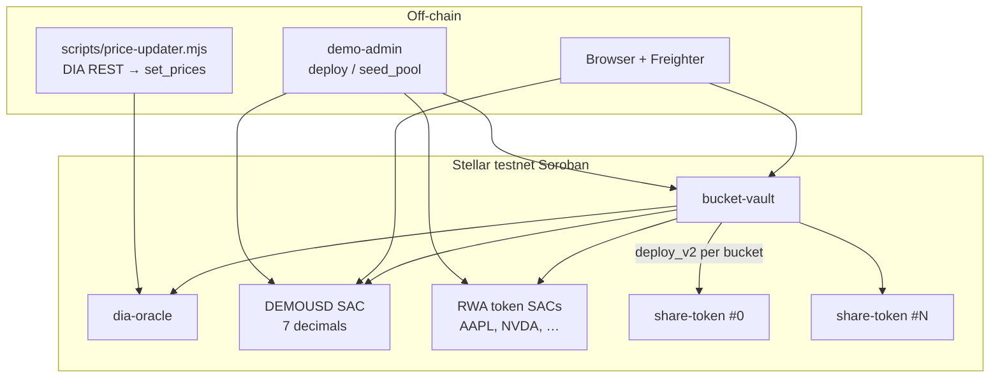
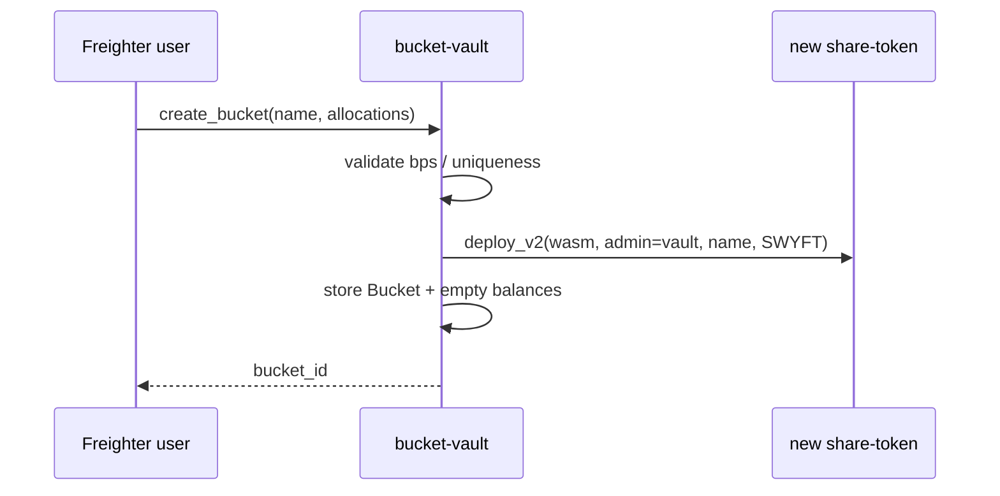
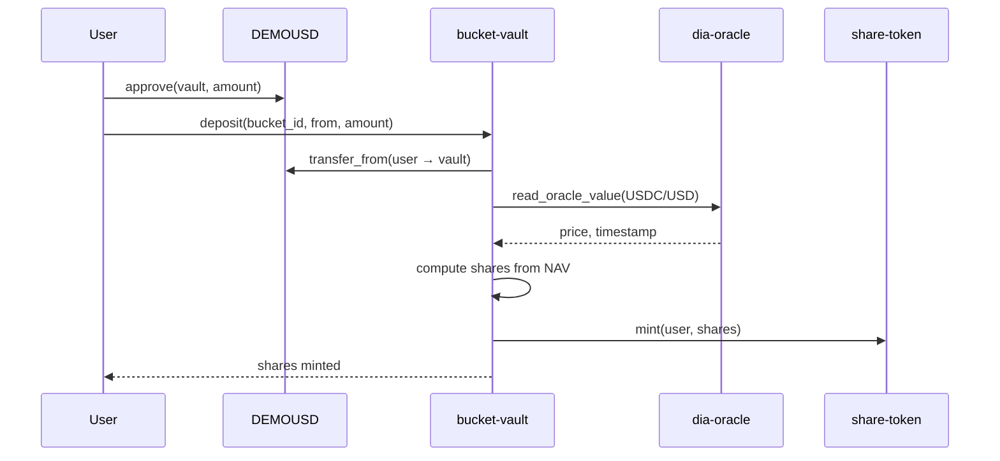

# Contracts flow architecture

How swyft.fun’s Soroban contracts work together: factory, custody, shares, prices, and the UI invest path.

## Contract map

| Contract | Crate | Responsibility |
|---|---|---|
| **bucket-vault** | `contracts/bucket-vault` | Initialize once; create baskets; custody USDC + RWA holdings; mint/burn shares; internal constant-product pools; permissionless `rebalance` |
| **share-token** | `contracts/share-token` | SEP-41 fungible share (8 decimals); admin-only `mint`; burn via allowance; one **instance per bucket** |
| **dia-oracle** | `contracts/dia-oracle` | DIA-compatible storage: `set_prices` (admin), `read_oracle_value(key) → (price_8dec, updated_at)` |

Deployed testnet IDs live in `scripts/.stellar-deploy.json` and are mirrored for the UI in `src/client/stellar/deploy.json`.



## Lifecycle

### 1. Bring-up (admin / scripts)

`scripts/deploy-stellar.mjs` (idempotent):

1. Fund demo keys (Friendbot).
2. Deploy `dia-oracle` with admin constructor; run one `price-updater` cycle.
3. Deploy DEMOUSD SAC; mint demo liquidity to admin.
4. Upload `share_token.wasm`; deploy `bucket-vault`; `initialize(...)`.
5. Per catalog asset: deploy token, mint, approve vault, `seed_pool` at oracle price.
6. Optionally create example buckets.

`initialize` stores:

- admin, USDC address, USDC DIA key (`USDC/USD`)
- oracle address
- **share-token wasm hash** (used by `deploy_v2` on each `create_bucket`)
- `staleness_secs` (e.g. 72h for weekend-safe stock feeds)
- `drift_bps` (rebalance threshold)

### 2. Create basket (`create_bucket`)

Anyone can create a basket (swipe UX builds one per invest).

Inputs:

- `name` (≤ 64 chars)
- `allocations[]`: `{ asset, dia_key, target_bps }`  
  - 1…20 legs, no duplicates, no USDC as allocation asset  
  - each `target_bps > 0`, sum ≤ 10_000

Effects:

1. Allocate next `bucket_id`.
2. `deploy_v2(share_wasm, (vault, name, "SWYFT"))` → new share-token; **vault is admin**.
3. Persist `Bucket { id, name, allocations, share_token }` and empty holdings map.
4. Return `bucket_id`.



### 3. Approve + deposit (user invest)

UI path (`investBasket` in `src/client/stellar/vault.ts`):

1. **Approve** DEMOUSD: `approve(from, vault, amount, expiration_ledger)`.
2. **Deposit**: `deposit(bucket_id, from, amount)`.

Deposit logic:

1. `from.require_auth()`; pull USDC via `transfer_from` into vault.
2. Read fresh USDC price from oracle (fail if stale/zero).
3. Compute deposit USD (8-dec scale).
4. Share mint:
   - **First depositor** (`supply == 0`): `shares = deposit_usd`.
   - **Later**: `shares = deposit_usd * supply / pre_deposit_nav`.
5. Credit bucket USDC balance; vault calls share-token `mint(from, shares)`.

Users hold **shares of the basket**, not individual RWA tokens, until withdraw.



### 4. Rebalance (keeper / anyone)

`rebalance(bucket_id, deadline, slippage_bps, min_outs[])`:

1. Reject if past deadline or slippage > 10% hard cap.
2. Price every holding via oracle (fail closed on stale).
3. Compare actual vs target weights; if drift ≤ `drift_bps`, no-op.
4. Sell overweight → USDC / buy underweight ← USDC against **internal CP pools** (`seed_pool` reserves).
5. Skip dust trades (&lt; $1 notionals); enforce `min_outs`.

Pools are admin-seeded demo liquidity. Pricing for NAV always comes from the oracle, not the pool mid.

### 5. Withdraw

`withdraw(bucket_id, user, shares)`:

1. User must have approved the vault to burn shares (`burn_from`).
2. Vault burns shares and pays a **pro-rata slice** of every holding (idle USDC + RWAs) to the user.

## Oracle contract

Wire-compatible with DIA Soroban shape:

| Method | Auth | Behavior |
|---|---|---|
| `set_prices(keys, values)` | admin | Batch upsert; extends TTL (~30d bump) |
| `read_oracle_value(key)` | — | Missing → `(0, 0)`; vault treats `price == 0` as `NoPrice` |

`scripts/price-updater.mjs` polls DIA RWA REST and writes batches (`--watch`, `--dry-run`).

Vault helper (`dia.rs`): requires `now - ts ≤ staleness_secs` (with a small clock-skew window) or panics `StalePrice`.

## Share token

OpenZeppelin `stellar-tokens` fungible + burnable:

- `__constructor(admin, name, symbol)` — 8 decimals
- `mint(to, amount)` — admin only (vault)
- `bump()` — instance TTL upkeep for keepers
- Standard SEP-41 transfer / approve / burn

## UI ↔ chain mapping

| UI action | Contract calls | Signatures |
|---|---|---|
| Invest on Stellar | `create_bucket` → USDC `approve` → `deposit` | 3 Freighter prompts |
| Simulate only | none (mock `demoSettle`) | 0 |
| Receipt explorer link | Stellar Expert tx hash | — |

Equal-weight allocations are built from selected symbols that exist in `deploy.json` (`GOOGL` → `GOOG`). Symbols without a deployed token are skipped on-chain with a review disclosure.

Decimals:

- DEMOUSD / vault USDC path: **7** (Stellar asset contract)
- Share token + DIA prices: **8**

## Invariants (important)

1. **Fail closed on price** — no deposit / NAV / rebalance with missing or stale feeds.
2. **Shares priced on pre-deposit NAV** — depositor cannot dilute themselves upward in the same call.
3. **Vault is sole minter** of each bucket’s share token.
4. **Allocation bps** — sum ≤ 100%; no USDC-as-asset; no duplicates.
5. **Rebalance** is permissionless but bounded by deadline, slippage cap, and `min_outs`.
6. **No upgrade path** on vault config — redeploy to change params.

## Tests

```bash
npm run test:contracts
```

| Crate | What is covered |
|---|---|
| `dia-oracle` | Roundtrip, overwrite, auth, length mismatch |
| `share-token` | Mint/metadata, non-admin mint, burn |
| `bucket-vault` | Deposit/NAV/rebalance, withdraw, stale price, bad allocs, zero deposit, double init, missing bucket, wasm `create_bucket` repro |

See [CONTRACTS_TEST_MATRIX.md](./CONTRACTS_TEST_MATRIX.md).

## Not in scope (MVP)

- External DEX router (pools are internal demo liquidity)
- Deposit fees, pause, upgradeability
- Production mainnet USDC / audited DIA dependency without self-hosted oracle
- Automated keeper bot in-repo (rebalance is callable; scheduling is ops)
