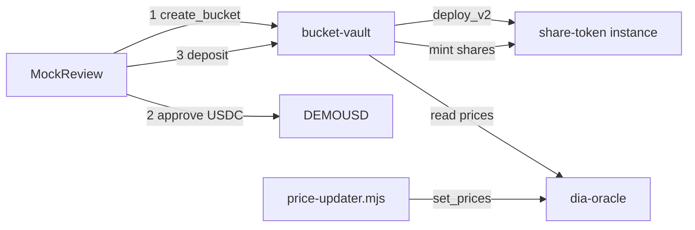

# Architecture

swyft.fun’s **default product** is a Stellar testnet UI: Freighter wallet, swipe-to-allocate, and Soroban vault deposits. The portfolio API lives in the sibling `server/` package (not under `swyft/src`).

## Runtime modes

| Mode | How | What runs |
|---|---|---|
| **Default** | `npm run dev` → `VITE_MOCK_UI=true` | Vite only. `MockApp` + fixture feed + Stellar kit/RPC |
| **Stack** | `npm run dev:stack` | Vite + `../server` portfolio API on :8787 |

```mermaid
flowchart TB
  subgraph default ["Default: npm run dev"]
    Browser --> MockApp
    MockApp --> Freighter["Stellar Wallets Kit / Freighter"]
    MockApp --> MockApi["mock/api fixtures"]
    MockApp --> VaultHelpers["stellar/vault.ts + rpc.ts"]
    VaultHelpers --> SorobanRPC["Soroban RPC testnet"]
    Freighter --> SorobanRPC
    SorobanRPC --> Vault["bucket-vault"]
    SorobanRPC --> USDC["DEMOUSD SAC"]
    SorobanRPC --> Oracle["dia-oracle"]
  end
```

## Client composition

| Module | Role |
|---|---|
| `src/client/main.tsx` | Chooses `MockApp` vs Privy `App` via `isMockUi()` |
| `src/client/mock/MockApp.tsx` | Stages: landing → onboarding → swipe → review → receipts/positions/account |
| `src/client/stellar/kit.ts` | Wallets Kit setup (Testnet) |
| `src/client/stellar/useStellarWallet.ts` | Connect / disconnect / address |
| `src/client/stellar/config.ts` | Deploy addresses from `deploy.json` |
| `src/client/stellar/rpc.ts` | Simulate → assemble → Freighter sign → submit → wait |
| `src/client/stellar/dia-api.ts` | DIA RWA REST spot + chart series for swipe cards |
| `src/client/stellar/vault.ts` | `create_bucket` / `approve` / `deposit` / `investBasket` |
| `src/client/mock/MockReview.tsx` | Review UI; **Invest on Stellar** or **Simulate only** |

### Client state (mock)

`MockApp` owns:

- `stage`: landing | onboarding | swipe | review
- `view`: week (basket) | positions | receipts | account
- Freighter address, preferences, feed, selected candidates
- Settlement / receipt record (hashes when on-chain)

Theme is `data-theme` light/dark via `theme.ts` (persisted `swyft:theme`).

## Domain layer

Shared, UI-agnostic logic under `src/domain/`:

- Schemas for preferences, candidates, execution records
- Ticket / period budget helpers
- Asset tag visibility (`asset-tag-config`)
- Epoch helpers for cadence labels

Mock feed fixtures live in `src/client/mock/data.ts` and prefer symbols that exist in `stellar/deploy.json` tokens.

## On-chain system

See **[CONTRACTS.md](./CONTRACTS.md)** for the full vault/share/oracle flow.

High-level:



## Rebalancing (current behavior)

1. Deposit parks DEMOUSD in the bucket and mints shares; holdings are idle USDC until rebalanced.
2. Targets come from `create_bucket` allocations (`target_bps` sum to 10_000). The UI uses equal weight across deployable symbols.
3. Anyone may call permissionless `rebalance` on `bucket-vault`. Drift within `drift_bps` (~2%) or dust under $1 is a no-op.
4. Overweight legs sell → USDC; underweight legs buy ← USDC via admin-seeded internal CP pools. NAV uses DIA oracle prices (fail closed if stale).
5. No automated keeper is shipped in-repo yet — scheduling is ops. Details: [CONTRACTS.md](./CONTRACTS.md).

## Legacy server path (optional)

Basket metadata / PnL go through `../server` (`/api/stellar/*`). On-chain invest still signs directly in Freighter — it does not go through Express.

## Trust boundaries (Stellar path)

- User signs every mutating Soroban tx in Freighter (create / approve / deposit).
- Deploy admin and price-updater hold the oracle + vault admin keys; users do not.
- UI treats RPC simulation results as untrusted until Freighter confirms and the hash settles.
- A quote or local “Simulate only” receipt is not on-chain settlement.
- Oracle staleness: vault **fails closed** if a feed is missing or older than `staleness_secs`.

## Related docs

- [USER_FLOW.md](./USER_FLOW.md) — screen journey
- [CONTRACTS.md](./CONTRACTS.md) — contract architecture
- [STELLAR_CHECKLIST.md](./STELLAR_CHECKLIST.md) — demo checklist
- [CONTRACTS_TEST_MATRIX.md](./CONTRACTS_TEST_MATRIX.md) — test matrix
